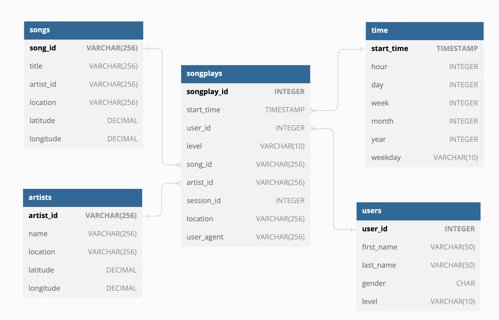
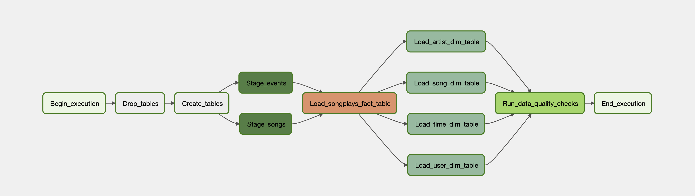

# Project: Data pipelines with Apache Airflow

## Introduction

A music streaming company, Sparkify, has decided that it is time to introduce more automation and monitoring to their data warehouse ETL pipelines and come to the conclusion that the best tool to achieve this is Apache Airflow.

They have decided to bring you into the project and expect you to create high grade data pipelines that are dynamic and built from reusable tasks, can be monitored, and allow easy backfills. They have also noted that the data quality plays a big part when analyses are executed on top the data warehouse and want to run tests against their datasets after the ETL steps have been executed to catch any discrepancies in the datasets.

The source data resides in S3 and needs to be processed in Sparkify's data warehouse in Amazon Redshift. The source datasets consist of JSON logs that tell about user activity in the application and JSON metadata about the songs the users listen to.

### Data sources

We have 2 datasets that reside in S3

- **Song data:** Is a subset of real data from the [Million Song Dataset](http://millionsongdataset.com/). Each file is in JSON format.
- **Log Data:** Is a log files in JSON format generated by this [event simulator](https://github.com/Interana/eventsim) based on the songs in the dataset above.

### Data base schema

We create two staging tables

##### Staging Tables

- **staging_songs:** info about songs
- **staging_evets:** info about user actions

##### Fact table

- **songplays:** records in event data associated with song plays i.e. records with page NextSong

##### Dimension tables

- **users:** users in the app
- **songs:** song in music database
- **artists:** songs in music database
- **time:** timestamps of records in songplays broken down into specific unit

The star Schema looks like this:

#### How to running the project

This project uses docker to run the Airflow environment. To run the project you need to follow the next steps:

1. `docker compose up airflow-init`: This command will create the Airflow database and the user to access to the Airflow UI.
2. `docker compose up`: This command will start the Airflow environment.

   > Note: You can use the `-d` flag to run the containers in the background.

3. Go to `http://localhost:8080` to access to the Airflow UI. The user and password are `airflow`.

#### How to run the DAG

1. Go to the Airflow UI.
2. You need to create the following connections:
   - `aws_credentials`: AWS credentials to access to the S3 bucket.
   - `redshift`: Redshift credentials to access to the Redshift cluster.
3. Go to the DAGs tab and enable the `final_project`.
4. Trigger the DAG.
5. Check the logs to see the progress of the DAG.

#### DAG Graph View

